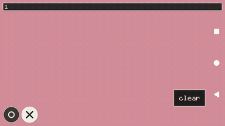
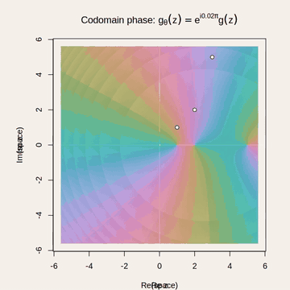

# Wegert

Interactive Wegert phase portraits of complex rational functions.

## Android app demo

<video controls muted loop src="https://raw.githubusercontent.com/isomorphismes/wegert/main/rendered_images/add-and-drag-two-zeros-and-two-poles.mp4"></video>

[](rendered_images/add-and-drag-two-zeros-and-two-poles.mp4)

The demo shows the Android app placing and dragging two zeros and two poles in the live phase portrait.

## Featured Wegert reference

This is the original Wegert-gist codomain-phase animation for `g(z) = (z - 1)(z - 2)(z - 5)`. The roots stay fixed at 1, 2, and 5 while only the codomain is multiplied by `exp(i theta)`.

[](wegert_g_codomain_phase.mp4?raw=1)

[MP4](wegert_g_codomain_phase.mp4?raw=1) · [static PNG](rendered_images/wegert_g.png)

Reference renderer: [`code/Wegert_g_codomain_phase.R`](code/Wegert_g_codomain_phase.R). It preserves the original R gist colour calculation and composition rather than substituting a different function or generic domain-colouring style.

## Other videos

Rendered media is canonical under [`rendered_images/`](rendered_images/). Useful files are also exposed at repository root. The featured reference MP4 is an ordinary file at root so GitHub raw download returns video bytes rather than a symlink blob.

- [Three moving simple roots](rendered_images/three_moving_simple_roots.mp4)
- [Two moving simple poles](rendered_images/two_moving_simple_poles.mp4)
- [Moving repeated zeros and poles](rendered_images/moving_repeated_zeros_and_poles.mp4)
- [Moving simple and repeated roots](rendered_images/moving_simple_and_repeated_roots.mp4)
- [Moving simple and double poles](rendered_images/moving_simple_and_double_poles.mp4)
- [Two simple zeros and two simple poles](rendered_images/moving_two_simple_zeros_and_two_simple_poles.mp4)
- [Android: place and drag one zero and one pole](rendered_images/add-and-drag-zero-and-pole.mp4)
- [Android: place and drag two zeros and two poles](rendered_images/add-and-drag-two-zeros-and-two-poles.mp4)

The 512x512 app icon is canonical at [`rendered_images/wegert-icon-512.png`](rendered_images/wegert-icon-512.png) and exposed at root as [`wegert-icon-512.png`](wegert-icon-512.png).

## Repository layout

- `code/` — canonical readable C, headers, GLSL, and render-source code.
- `rendered_images/` — canonical rendered PNG/MP4 output.
- repository root — README/license, source-entrypoint symlinks, and an ordinary copy of the featured MP4 for reliable GitHub downloads.
- `_/build/` — Android packaging, Gradle, CMake, tests, F-Droid/Triple-T metadata, checked build objects/provenance, and other build/release machinery.
- `.github/` — workflow files remain at the required GitHub path.

The build tree already uses symlinks for the readable source. Root source names remain valid as symlinks into `code/`, so existing `_/build` references keep working without duplicating the source.

## Mathematical ownership boundary

Wegert owns how an already-defined complex function is presented: the reusable complex-value or phase/log-modulus to colour behavior, ordinary factored zero/pole interaction, coordinate mapping, and rendering preferences. [`code/wegert_color.glsl`](code/wegert_color.glsl) is the canonical shader colour core.

[Analytic Continuation](https://github.com/isomorphismes/analytic-continuation) owns the live whole-plane evolution `f = R exp(q)`, the requirement that `q` be entire, and the choice of admissible holomorphic descriptors. It supplies the completed phase and log modulus to the Wegert boundary; this repository does not choose Bergman, Bargmann-Fock, or other perturbation spaces.

[Lacunary](https://github.com/isomorphismes/lacunary) owns bounded/local-domain continuation, overlapping charts, branches, sheets, and monodromy experiments. Those are distinct from both Wegert's rendering contract and Analytic Continuation's ordinary whole-plane explorer.

## First playable controls

- tap the ○ or × control, then tap the portrait to add that kind of factor (up to 64 each)
- one-finger drag from an existing marker: move that factor
- one-finger drag from empty portrait space: move the visible complex domain
- pinch: zoom the visible domain
- `clear`: remove every zero and pole without moving the visible domain
- three-finger tap: restore `g(z) = (z - 1)(z - 2)(z - 5)` and recenter the camera
- Android Back: leave the activity using the system control rather than an in-app exit button

The initial view is centered at the ordinary complex zero. Zeros are shown as dark rings with light centers; poles are shown as dark crosses.

Touching near an opposite marker snaps to that marker's stored coordinate using a density-aware touch target: placing a zero there removes one pole instead of storing the zero, and placing a pole on a zero works the same way. Cancellation is one-for-one, including repeated factors. This screen-space touch aid does not change the exact-coordinate rule for programmatic factor values, so merely nearby stored factors remain distinct.

Clear activates only when the first finger is released inside the control. Additional fingers cancel that pending control action and cannot turn it into a pinch or three-finger reset. Pinch and three-finger reset remain available when the gesture begins on the portrait.

## Colouring

The Android shader preserves the established Wegert palette constants from the current repository renderer:

- HCL chroma: `45`
- lightness base: `66`
- log-modulus contribution: `4`
- hue-band contribution: `3`

Hue is the phase of the rational function. The Android renderer's lightness repeats by base-10 log-modulus decades. HCL is converted to display sRGB in the fragment shader.

The featured `wegert_g_codomain_phase.mp4` intentionally uses the older R gist rule instead: hue is `Arg(f(z))`, and lightness is `66 + 4*fract(|f(z)|/100) + 3*fract(hue/100)` with HCL chroma `45`. Its viewport, fixed roots, labels, cream frame, and codomain-only phase rotation come directly from the preserved R reference renderer.

## Reusable frame rendering

The mathematical portrait renderer is independent of Android UI code. A host
program can keep one offscreen EGL/GLES context alive and render successive
`wegert_scene` values through the same
`wegert_portrait_renderer_gles_render_frame()` path used by the app.

`code/wegert_render_frames.c` is a small stream driver for that boundary. It
reads zero/pole coordinates for successive frames on standard input and emits
top-origin RGB24 frames on standard output. Movie tooling can therefore choose
the scene for each frame without reimplementing rational-function evaluation or
Wegert colouring.

The host driver requires EGL/GLES development libraries. From `_/build`:

```sh
./android-direct/assemble-shader.sh /tmp/wegert.frag
cc -std=c11 -Wall -Wextra -Werror -pedantic \
  wegert_function.c wegert_view.c wegert_scene.c \
  wegert_gles.c wegert_portrait_renderer_gles.c \
  wegert_offscreen_gles.c wegert_render_frames.c \
  -lEGL -lGLESv2 -lm -o /tmp/wegert-render-frames

printf '3 0 1 0 2 0 5 0\n' |
  EGL_PLATFORM=surfaceless /tmp/wegert-render-frames \
    /tmp/wegert.frag 640 480 0 0 3.5 > /tmp/frame.rgb
```

The stream driver deliberately renders the portrait only. Android controls,
formula overlays, movie encoding and other presentation belong downstream of
this boundary.

## Android build

Requirements are Android SDK 36, NDK r29 (`29.0.14206865`), CMake 3.22.1, JDK 17, Gradle 9.5.1, and Android Gradle Plugin 9.3.1.

```sh
cd _/build
gradle :app:assembleDebug
```

The host-side gesture, pinch-zoom, factor-drag, canonical-factor, touch-snap, complex-arithmetic, and formula-formatting rules can be checked from the same build directory without an Android toolchain:

```sh
cd _/build
cc -std=c11 -Wall -Wextra -Werror -pedantic wegert_function.c wegert_view.c wegert_scene.c tests/test_wegert_scene.c -lm -o /tmp/wegert-scene-test
/tmp/wegert-scene-test
cc -std=c11 -Wall -Wextra -Werror -pedantic wegert_function.c tests/test_wegert_function.c -o /tmp/wegert-function-test
/tmp/wegert-function-test
cc -std=c11 -Wall -Wextra -Werror -pedantic wegert_placement_controls.c tests/test_wegert_placement_controls.c -lm -o /tmp/wegert-placement-controls-test
/tmp/wegert-placement-controls-test
cc -std=c11 -Wall -Wextra -Werror -pedantic tests/test_gesture_state.c -lm -o /tmp/wegert-gesture-test
/tmp/wegert-gesture-test
cc -std=c11 -Wall -Wextra -Werror -pedantic tests/test_factor_state.c -o /tmp/wegert-factor-test
/tmp/wegert-factor-test
cc -std=c11 -Wall -Wextra -Werror -pedantic tests/test_factor_snap.c -lm -o /tmp/wegert-factor-snap-test
/tmp/wegert-factor-snap-test
cc -std=c11 -Wall -Wextra -Werror -pedantic tests/factor_drag_test.c -lm -o /tmp/wegert-factor-drag-test
/tmp/wegert-factor-drag-test
cc -std=c11 -Wall -Wextra -Werror -pedantic complex_math_fallback.c tests/complex_math_test.c -lm -o /tmp/wegert-complex-math-test
/tmp/wegert-complex-math-test
cc -std=c11 -Wall -Wextra -Werror -pedantic tests/test_polynomial_text.c complex_math_fallback.c -lm -o /tmp/wegert-polynomial-text-test
/tmp/wegert-polynomial-text-test
```

The APK is written to repository path:

```text
_/build/app/build/outputs/apk/debug/app-debug.apk
```

Debug APKs use the repository's public test-only signing key and the source-controlled `0.2.0` version identity. The checked-in debug key is deliberately public and must never sign a production release.

The debug APK contains `arm64-v8a` and `armeabi-v7a` for phone/tablet targets and `x86_64` solely for CI emulation.

## Device emulation

GitHub Actions smoke-tests the APK against two constrained virtual-device profiles:

| Target | Android | RAM | logical display | CI CPU/GPU |
| --- | --- | ---: | --- | --- |
| MIRO A1 approximation | 14 / API 34 | 2 GiB | 720x1280 @ 320 dpi | x86_64 / SwiftShader GLES |
| TAB_P10 approximation | 15 / API 35 | 4 GiB | 1280x800 @ 160 dpi | x86_64 / SwiftShader GLES |

Each emulator installs and launches Wegert, drags an existing zero, places a finite pole, pans from empty portrait space, checks the rational-function overlay, activates clear, leaves through Android Back, fails on EGL/shader/link/fatal errors, and saves a screenshot plus application log.

These are compatibility profiles, not cycle-accurate hardware emulations. Real-device testing still covers ARM64 code generation, vendor GLES behavior, multi-touch, and device-specific Android quirks.

## Shader/compiler boundary

The repository already has an Idris2 -> GLSL ES backend at [`isomorphisms/idris-shader-backend`](https://github.com/isomorphisms/idris-shader-backend). That backend now exercises two-argument `atan`, `log`, fixed uniform arrays, bounded computation, and a full 64-zero/64-pole Wegert portrait. This Android app still uses the direct canonical GLSL core; changing the source-generation path is a separate integration decision and must preserve the same value-to-colour behavior.
