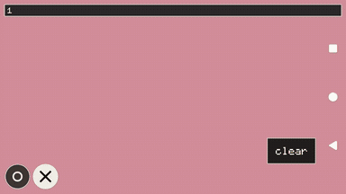
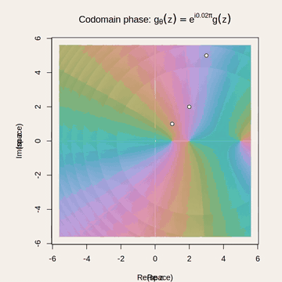

# Wegert

Interactive phase portraits of complex rational functions.

Add zeros ○ and poles × on the complex plane. Drag them, pan, and pinch to zoom. The portrait and the displayed formula update from the same factor state.

[](rendered_images/add-and-drag-two-zeros-and-two-poles.mp4)

**Android test build:** [v0.1.50 APK](https://github.com/isomorphismes/wegert/releases/download/v0.1.50/wegert-0.1.50.apk) · [all releases](https://github.com/isomorphismes/wegert/releases)

The APK is a prerelease signed with the repository's public test key.

## Read the picture

For a complex function `f(z)`:

- hue records `arg f(z)`
- lightness repeats with `log10 |f(z)|`
- zeros are rings
- poles are crosses

The reusable colour core is [`code/wegert_color.glsl`](code/wegert_color.glsl). Function construction stays upstream of that boundary.

This project follows the phase-portrait approach developed by **Elias Wegert**. See [*Visual Complex Functions: An Introduction with Phase Portraits*](https://doi.org/10.1007/978-3-0348-0180-5).

## Controls

- tap ○ or ×, then tap the portrait to add a zero or pole
- drag a marker to move that factor
- drag empty space to pan
- pinch to zoom
- `clear` removes all zeros and poles
- three-finger tap restores `g(z) = (z - 1)(z - 2)(z - 5)`
- placing a zero on a pole, or a pole on a zero, cancels one factor

## Reference render

The preserved reference animation keeps the roots of

`g(z) = (z - 1)(z - 2)(z - 5)`

fixed while the codomain is multiplied by `exp(i theta)`.

[](wegert_g_codomain_phase.mp4?raw=1)

[MP4](wegert_g_codomain_phase.mp4?raw=1) · [static PNG](rendered_images/wegert_g.png) · [R renderer](code/Wegert_g_codomain_phase.R)

More rendered examples are in [`rendered_images/`](rendered_images/).

## Code

Readable source lives in [`code/`](code/).

- `wegert_color.glsl` — phase/log-modulus to colour
- `wegert_function.c` — rational-function state
- `wegert_scene.c` — zeros, poles, and view state
- `wegert_portrait_renderer_gles.c` — GLES portrait renderer
- `wegert_render_frames.c` — offscreen RGB24 frame stream
- `_/build/` — Android packaging, tests, CI, and release machinery

The root-level C/GLSL names remain entry-point symlinks into `code/`.

## Build

Requirements: Android SDK 36, NDK r29 (`29.0.14206865`), CMake 3.22.1, JDK 17, Gradle 9.5.1, and Android Gradle Plugin 9.3.1.

```sh
cd _/build
gradle :app:assembleDebug
```

The debug APK is written to:

```text
_/build/app/build/outputs/apk/debug/app-debug.apk
```

It contains `arm64-v8a` and `armeabi-v7a` for devices, plus `x86_64` for CI emulation.

## Scope

Wegert's reusable boundary is the phase-portrait presentation: colour mapping, coordinates, markers, and ordinary zero/pole interaction.

[Analytic Continuation](https://github.com/isomorphismes/analytic-continuation) owns whole-plane evolution of `f = R exp(q)`.

[Lacunary](https://github.com/isomorphismes/lacunary) owns bounded/local continuation, charts, branches, sheets, and monodromy experiments.
